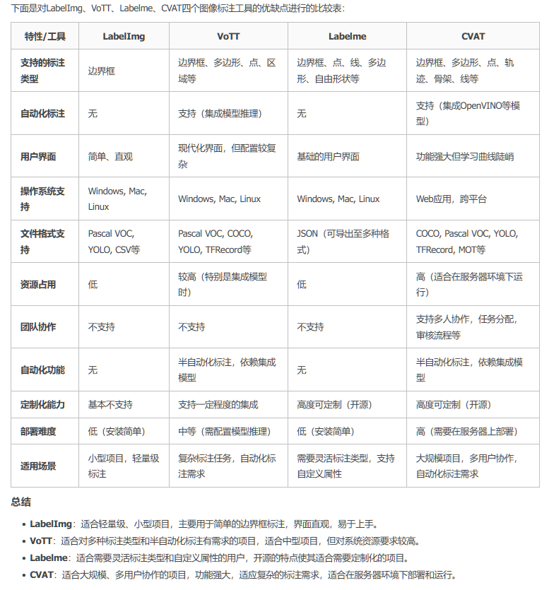

# LabelImg、VoTT、Labelme、CVAT四个图像标注工具的优缺点
LabelImg、VoTT、Labelme、CVAT是常用的图像标注工具，每个工具都有其独特的功能和适用场景。以下是对这几个工具的优缺点的详细分析：

## 1. LabelImg
### 优点
- 简单易用：有着非常直观的用户界面，适合初学者和非技术用户，可通过点击和拖拽轻松创建边界框。
- 轻量级：工具运行速度快，适用于笔记本电脑等资源有限的环境。
- 多种格式支持：支持输出XML（Pascal VOC）、TXT（YOLO）、CSV等多种标注格式，适配不同计算机视觉任务。
- 跨平台：可在Windows、Mac和Linux系统上运行，使用便捷。

### 缺点
- 功能有限：仅支持边界框标注，不支持多边形、线条或点等复杂形状标注。
- 团队协作缺失：不支持多人协作，缺少管理和协同功能，难以处理大型标注项目。
- 缺乏自动化：无内置自动标注或半自动化功能，标注工作完全依赖人工，效率较低。

---

## 2. VoTT（Visual Object Tagging Tool）
### 优点
- 丰富的标注类型：支持边界框、区域（多边形）、点等多种标注类型，能满足复杂标注需求。
- 集成模型推理：可集成自定义机器学习模型，支持半自动化标注，提升标注效率。
- 多格式导出：支持Pascal VOC、COCO、YOLO、TFRecord等多种输出格式，适配多种深度学习框架。
- 集成数据流：可直接从Azure、AWS、GCP等云存储导入数据，也支持本地文件系统，方便数据管理。

### 缺点
- 资源占用较大：使用时占用较多系统资源，尤其是集成模型推理时，需要较高硬件配置。
- 配置复杂：与LabelImg相比，配置和设置相对复杂，初学者需花费时间熟悉。
- 缺乏团队协作功能：虽有数据流集成，但本身不提供多用户协作或版本管理功能。

---

## 3. Labelme
### 优点
- 多样化的标注工具：支持边界框、点、线、多边形、自由形状等多种标注类型，适合复杂图像标注需求。
- 自定义属性：允许用户为标注对象添加自定义属性，支持更灵活丰富的标注。
- 开源可定制：属于开源软件，可根据具体需求进行二次开发和定制，适应特殊项目需求。
- 轻量级：与LabelImg类似，适用于资源受限的环境。

### 缺点
- 用户界面较基础：界面和操作体验不如部分现代化工具，不太适合需要高效标注的项目。
- 缺乏自动化功能：未集成机器学习模型进行自动标注或建议标注，效率相对较低。
- 团队协作能力欠缺：与LabelImg类似，缺乏团队协作和项目管理功能，不适合大型团队项目。

---

## 4. CVAT（Computer Vision Annotation Tool）
### 优点
- 功能强大：支持边界框、多边形、骨架、点、轨迹等多种标注类型，适合视频标注、3D标注等复杂计算机视觉任务。
- 支持团队协作：作为Web应用，支持多用户协作、任务分配、审核流程等，适合大规模标注项目。
- 自动化标注：集成OpenVINO和其他深度学习模型，可实现半自动化标注，显著提高效率。
- 丰富的导入/导出格式：支持COCO、Pascal VOC、YOLO等多种格式，兼容性强。
- 高度可定制：作为开源项目，允许用户根据需要定制和扩展，适应不同项目需求。

### 缺点
- 资源需求高：功能丰富且支持多人协作，部署和运行对系统资源要求较高，尤其处理大规模数据时。
- 部署复杂：需要在服务器上部署，非技术人员或小团队初始设置可能较为复杂。
- 学习曲线陡峭：功能繁多，初学者需花费时间熟悉操作界面和工作流程。

---

## 总结
- LabelImg：适合需要快速、轻量级标注的初学者或小型项目，主要用于简单的边界框标注。
- VoTT：适合有一定技术背景的用户，尤其适用于需要集成自动化标注和多格式输出的场景，但资源消耗较大。
- Labelme：适合需要灵活标注类型和自定义属性的用户，开源特性使其适合定制化需求，但缺乏自动化和协作功能。
- CVAT：适合大规模、多用户协作的标注项目，功能强大，支持多种标注类型和自动化标注，但需要较高的资源和技术投入。

---

## 四个图像标注工具的优缺点比较表
